<h1 align="center">Thrive Juices and Smoothies Website</h1>

[View the live project here.](https://elainebroche-dev.github.io/ms1-thrive/)

THRIVE Juices and Smoothies is a site that advertises a fictional refreshment business.  The business primarily sells juices and smoothies and also a limited range of healthy snacks and hot beverages.  The site is targeted toward people who want to buy healthy refreshments "on the go" - the business also has a seating area for anyone who wants to stay and socialise but it's primary USP is the appeal, taste and quality of the products.  The site will be useful for people who want to check out the range of products available, location of the business and it's opening hours.

## Index – Table of Contents
* [User Experience (UX)](#user-experience-ux) 
* [Features](#features)
* [Design](#design)
* [Technologies Used](#technologies-used)
* [Testing](#testing)
* [Deployment](#deployment)
* [Credits](#credits)

## User Experience (UX)

-   ### User stories

    -   #### A. First Time Visitor Goals

        1. As a First Time Visitor, I want to easily understand the main purpose of the site and learn more about the organisation.
        2. As a First Time Visitor, I want to be able to easily navigate throughout the site to find content.
        3. As a First Time Visitor, I want to be able to easily navigate to and view a menu of drinks and snacks.
        4. As a First Time Visitor, I want to be able to easily find where the organisation is located.

    -   #### B. Returning Visitor Goals

        1. As a Returning Visitor, I want to be able to access and view the menu quickly and easily.
        2. As a Returning Visitor, I want to be able to check opening times quickly and easily.
        3. As a Returning Visitor, I want to be able to contact the organisation to give feedback or ask questions.

    -   #### C. Frequent User Goals
        1. As a Frequent User, I want to be able to sign-up easily for discounts.
     

## Features

### Existing Features

-   __F01 Navigation Bar__

    - The navigation bar has a consistent look and placement on all three pages of the website supporting easy navigation.  It includes a simple Logo, Home page, Menu and Contact links and is responsive on multiple screen sizes.  On small screens (e.g. mobile devices) the Home, Menu and Contact links move to under the Logo.

      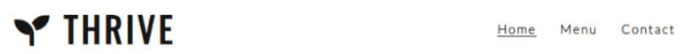
    

-   __F02 Landing Page image and call to action__

    - The landing area includes a photograph and a text overlay that together clearly identify the purpose of the business and the type of product it sells.  The citrus colours and 'welcome' message are intended to be appealing to the user and convey a sense of health, freshness and friendliness.

    - A large bright "See Our Menu" button is placed central to the screen as an eye-catching call to action which gives the user an obvious quick route to the menu page.

      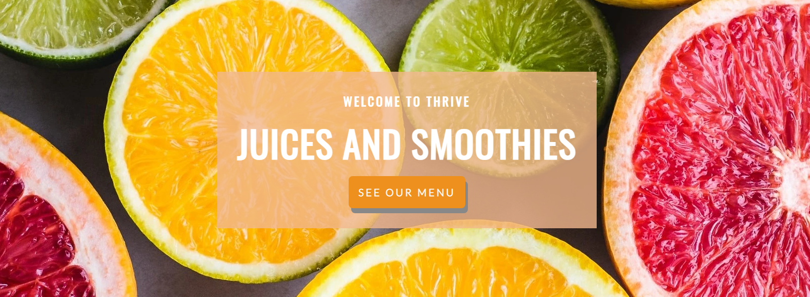

- __F03 Tagline__

    - The "enjoy here or takeaway - the choice is yours" tagline appears on the main page and again on the menu page to let the user know that seating is available and to help re-inforce consistency in branding.

      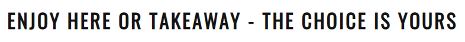

- __F04 Company Ideals section__

    - The company ideals are presented using 4 flip cards below the tagline on the main page.  These cards give the user more information about the organisation in relation to it's strategy in the areas of quality, sourcing of ingredients, recycling and philanthropy.
    
      

- __F05 Footer__

    - The footer is featured on all three pages and is identical on each page making it easy to use.  It contains three sections :

        - Opening Times - having the opening times in the footer on each page allows the user to quickly and easily find this information, this is important for this type of business as it is information that the user needs in order to make use of the company (product is sold offline).

        - Address - similar to the opening times, the address of this type of business is important to the user in order for them to use the company and so has been repeated on each page in the footer to quickly and easily find out where the company is located 

        - Stay in Touch - this area has links to social media sites associated with the organisation encouraging the user to keep connected.  The links will open in a new tab to allow easy navigation for the user. The organisation can use these sites to promote brand awareness and keep customers interested through updates, offers, chats and other marketing efforts. (As THRIVE is a ficticious company, the links currently just go to the social media main websites.)

      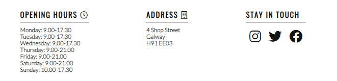

- __F06 Menu Page - 'Carte' section__

    - The menu page gives a list of the products that can be purchased at THRIVE.  For ease of use and clarity for the user the products have been split into three panels, one for 'Fresh Juices', one for 'Smoothies', and the the third for 'Healthy Snacks and Hot Drinks'.  Pricing and ingredients are also shown.
    
    - For ease of use, a consistent look and feel is maintained through the use of the same background image as is used for the landing image on the main page, and in applying the same background colour to the menu panels as is used on the overlay text area on the main page.  Text colour is kept simple for readability and to minimise distraction.

       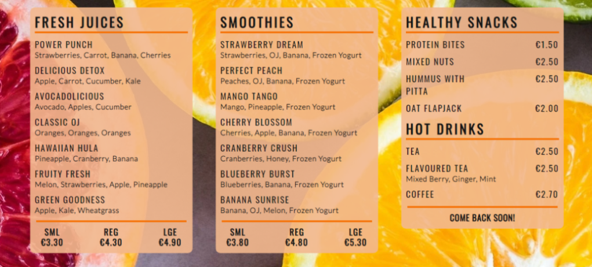

- __F07 Contact Page - 'Contact Us'__

    - The 'Contact Us' panel of the Contact page allows the user to send a message/give feedback to the company and if they want, sign up to the company mailing list to get discount codes and offers.  The user is asked to provide their name and email address when sending a message.  By default, the option to join the mailing list is set to 'no' - to prevent them accidentally signing up for the mailing list and getting unwanted email.  Sending the message will result in a new tab showing the results (at the moment the user is simply shown the formdump.codeinstitute.net page with the data they submitted displayed)

      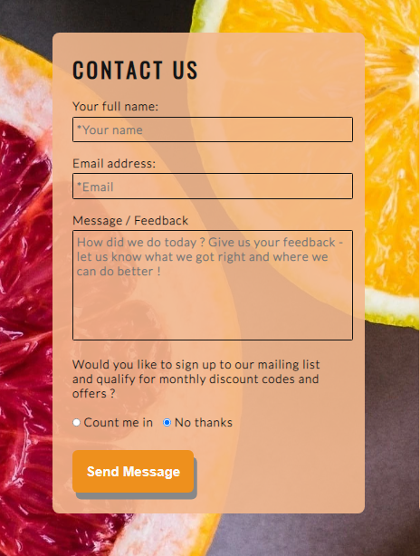

- __F08 Contact Page - 'How to Find Us'__

    - The 'How to Find Us' panel of the Contact page gives the user an interactive google map area showing the location of the company along with details on full address, phone number and administration email address in large font to make it easily readable.  By clicking the 'View larger map' link the user can go to the google maps site for the address - this opens in a separate tab to allow ease of navigation.

      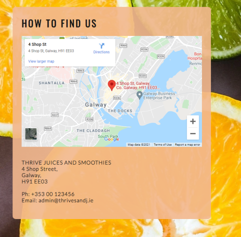

- __How these features support the User Stories__

    - The User Stories in the [User Experience (UX)](#user-experience-ux) part of this document are numbered and categorised into groups A (first time visitor), B (returning visitor) and C (frequent visitor).  The existing features are listed above as F01 to F08.  Below is a traceability matrix cross-referencing the user stories with the features, illustrating which features support which stories :

    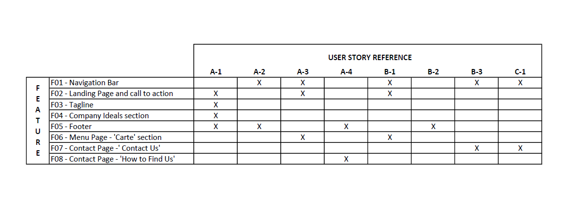

### Features which could be implemented in the future

- __Company Timeline__
    - A 'Company Timeline' page could be added to provide more information on the evolution of the business and for users who would like to know more about the origins of the company, it's ethos and it's involvement with the community.

- __Navigation bar improvements__
    - The functionality of the navigation bar could be extended to make it "sticky" so that it would be available to user without scrolling.
    - A hamburger menu could be implemented to save space on smaller screens.

## Design

-   ### Imagery
    -   The hero and large background images have been chosen because they are eye-catching, fresh and bright.  The citrus and light pastel colours in the images were chosen to help convey a sense of energy, health and freshness.  The images depict fruit to align with the main business goal of selling juices and smoothies and were chosen for their "simplicity" (- e.g. a single type of fruit or repeating theme) to help keep the site clear and easy to use.

-   ### Colour Scheme
    -  A citrus/pastel palette was chosen to convey a fresh, energetic mood.  The colours picked were inspired by a palette from [Lily Bug Design](https://www.lilybugdesign.co.nz/colour-wall)

        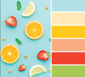

-   ### Typography
    -   Google Fonts were used to import Lato and Oswald fonts into styles.css.  These were chosen as they work well together and have a simple, unembellished, modern feel that is easy to read.

-   ### Wireframes

    -   #### Main Page Wireframes

        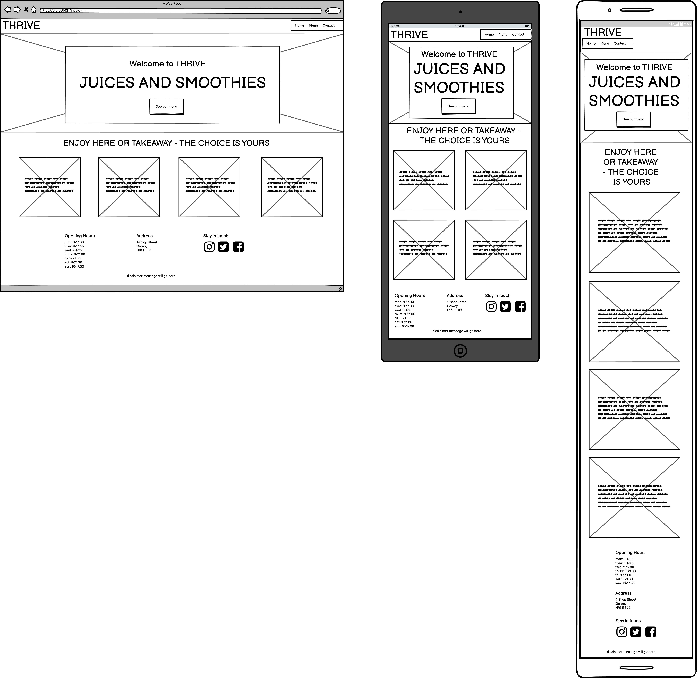

    -   #### Menu Page Wireframes

        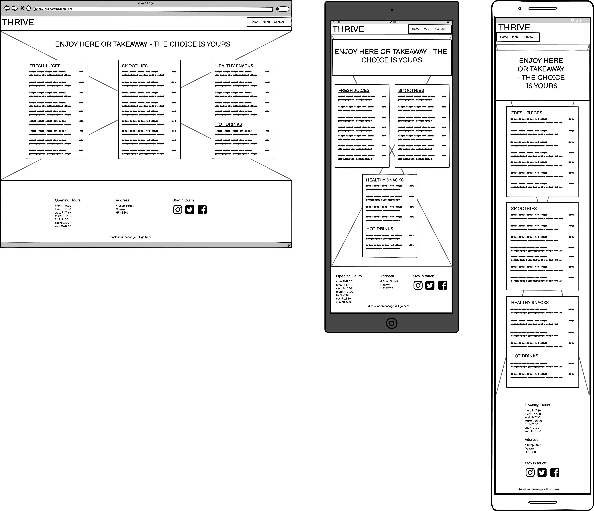

    -   #### Contact Page Wireframes

        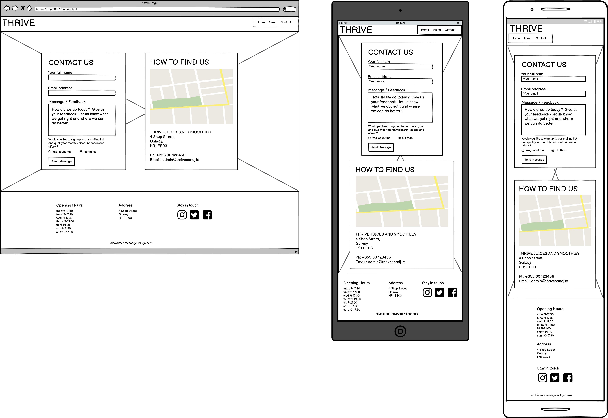

## Technologies Used

### Languages Used

-   [HTML5](https://en.wikipedia.org/wiki/HTML5)
-   [CSS3](https://en.wikipedia.org/wiki/Cascading_Style_Sheets)

### Frameworks, Libraries & Programs Used

-   [Google Fonts:](https://fonts.google.com/) was used to import the 'Lato' and 'Oswald' fonts into the style.css file which are used on all pages of the project.
-   [Font Awesome:](https://fontawesome.com/) was used to add icons for aesthetic and UX purposes.
-   [Git](https://git-scm.com/) was used for version control by utilizing the Gitpod terminal to commit to Git and Push to GitHub.
-   [GitHub:](https://github.com/) is used as the respository for the projects code after being pushed from Git.
-   [Microsoft Paint 3D:](https://www.microsoft.com/en-us/p/paint-3d/9nblggh5fv99?activetab=pivot:overviewtab) was used for resizing images and editing photos for the website.
-   [Balsamiq:](https://balsamiq.com/) was used to create the wireframes during the design process.
    

## Testing

### Validator Testing

- [HTML Validator](https://validator.w3.org/)

    - result for index.html
      
    - result for menu.html
      
    - result for contact.html
      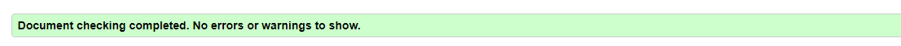

    - Full validation results are available on github here :

        - <a href="https://github.com/elainebroche-dev/ms1-thrive/blob/master/assets/documentation/validation-results/html-validation-results-index.pdf" target="_blank">HTML Results - Home Page</a>

        - <a href="https://github.com/elainebroche-dev/ms1-thrive/blob/master/assets/documentation/validation-results/html-validation-results-menu.pdf" target="_blank">HTML Results - Menu Page</a>

        - <a href="https://github.com/elainebroche-dev/ms1-thrive/blob/master/assets/documentation/validation-results/html-validation-results-contact.pdf" target="_blank">HTML Results - Contact Page</a>

- [CSS Validator](https://jigsaw.w3.org/css-validator/)

    - result for styles.css 
      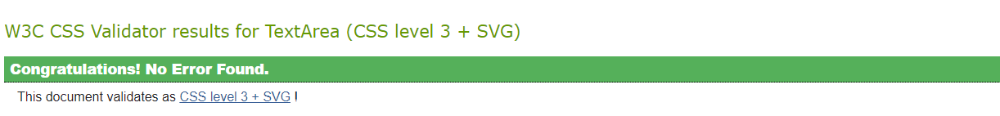
      

    the warnings are due to 1) import of the Google fonts and 2) a webkit extension for Safari support of the flip-card effect used on the home page.

    - Full validation results are available on github here :

        - <a href="https://github.com/elainebroche-dev/ms1-thrive/blob/master/assets/documentation/validation-results/css-validation-results.pdf" target="_blank">CSS Results - styles.css</a>

### Test Cases and Results

- The below table details the test cases that were used, the results and a cross-reference to the Feature ID that each test case exercised :

  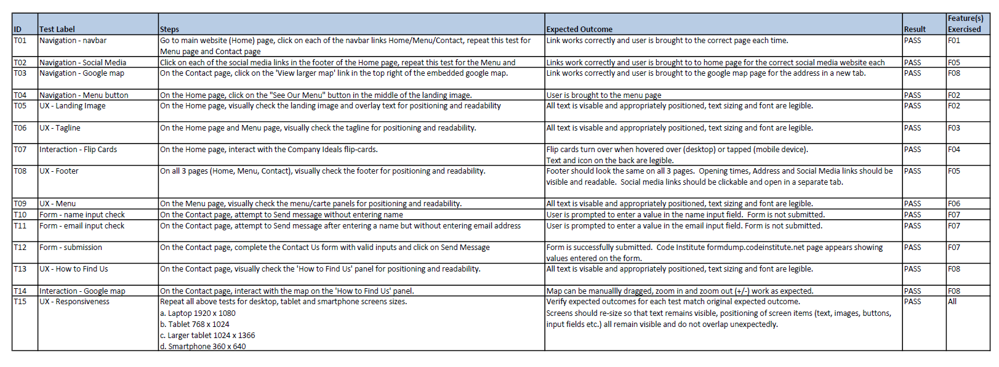

## Deployment

- The site was deployed to GitHub pages. The steps to deploy are as follows: 
  - In the GitHub repository, navigate to the Settings tab, then choose Pages from the left hand menu 
  - From the source section drop-down menu, select the Master Branch
  - Once the master branch has been selected, the page will be automatically refreshed with a detailed ribbon display to indicate the successful deployment. 
  
  The live link can be found here - [THRIVE Juices and Smooties](https://elainebroche-dev.github.io/ms1-thrive/index.html) 

## Credits 

### Content 
- Content on the menu page was loosely based on menus on [Jump Juice Bar](https://www.jumpjuicebar.com/menu-nutrition-smoothies/)
- All other content was written by the developer

### Code
- Code on how to do the fade-in of the hero image came from information on this page : [CSS Image fade-in tutorial](https://blog.hubspot.com/website/css-fade-in)
- Code on how to do a rounded button as seen on the index.html page was based on code on : [W3Schools Rounded button tutorial](https://www.w3schools.com/howto/howto_css_round_buttons.asp)
- Code on how to do the flip-card effect on the index.html page was based on example code on : [W3Schools Flip card tutorial](https://www.w3schools.com/howto/howto_css_flip_card.asp)
- Code on how to include google map with marker was based on code from this site :  [How to embed Google Map](https://www.maps.ie/create-google-map/)
- Code on how to implement flex boxes was based on instructions from [YouTube Flexbox Tutorial](https://www.youtube.com/watch?v=S0a7PEOi0do)

### Media 
- The colours used were based on a citrus/pastel palette from this website : [Lily Bug Design - Colour Wall](https://www.lilybugdesign.co.nz/colour-wall) 
- The icons in the header, footer and on the back of the flip-cards were taken from [Font Awesome](https://fontawesome.com/)
- The fonts used were imported from [Google Fonts](https://fonts.google.com/)

- All images were downloaded from [Unsplash](https://unsplash.com) :

    - <a href="https://images.unsplash.com/photo-1546548970-71785318a17b?ixid=MnwxMjA3fDB8MHxwaG90by1wYWdlfHx8fGVufDB8fHx8&ixlib=rb-1.2.1&auto=format&fit=crop&w=334&q=80">Main (hero/landing) image and background image</a> photo by <a href="https://unsplash.com/@brunabranco?utm_source=unsplash&utm_medium=referral&utm_content=creditCopyText">Bruna Branco</a> 

    - <a href="https://unsplash.com/photos/9aOswReDKPo?utm_source=unsplash&utm_medium=referral&utm_content=creditShareLink" target="_blank" rel="noopener">Avocado</a> photo by <a href="https://unsplash.com/@thoughtcatalog?utm_source=unsplash&utm_medium=referral&utm_content=creditCopyText" target="_blank" rel="noopener">Thought Catalog</a>

    - <a href="https://images.unsplash.com/photo-1595475207225-428b62bda831?ixid=MnwxMjA3fDB8MHxwaG90by1wYWdlfHx8fGVufDB8fHx8&ixlib=rb-1.2.1&auto=format&fit=crop&w=500&q=80" target="_blank" rel="noopener">Watermelon</a> photo by <a href="https://unsplash.com/@amyshamblen?utm_source=unsplash&utm_medium=referral&utm_content=creditCopyText" target="_blank" rel="noopener">Amy Shamblen</a> 

    - <a href="https://images.unsplash.com/photo-1564769610726-59cead6a6f8f?ixid=MnwxMjA3fDB8MHxwaG90by1wYWdlfHx8fGVufDB8fHx8&ixlib=rb-1.2.1&auto=format&fit=crop&w=448&q=80" target="_blank" rel="noopener">Sliced oranges</a> photo by <a href="https://unsplash.com/@euniquedeeann?utm_source=unsplash&utm_medium=referral&utm_content=creditCopyText" target="_blank" rel="noopener">Eunique Deeann</a> 

    - <a href="https://images.unsplash.com/photo-1559181567-c3190ca9959b?ixlib=rb-1.2.1&ixid=MnwxMjA3fDB8MHxwaG90by1wYWdlfHx8fGVufDB8fHx8&auto=format&fit=crop&w=400&q=80" target="_blank" rel="noopener">Cherries</a> photo by <a href="https://unsplash.com/@picoftasty?utm_source=unsplash&utm_medium=referral&utm_content=creditCopyText" target="_blank" rel="noopener">Mae Mu</a> 

### Acknowledgments

- Thank you to my mentor Brian Macharia who gave me very good advice and feedback on how to plan and execute this project and who provided me with lots of pointers on resources to help select colours and images and well as resources to help with coding and testing.

